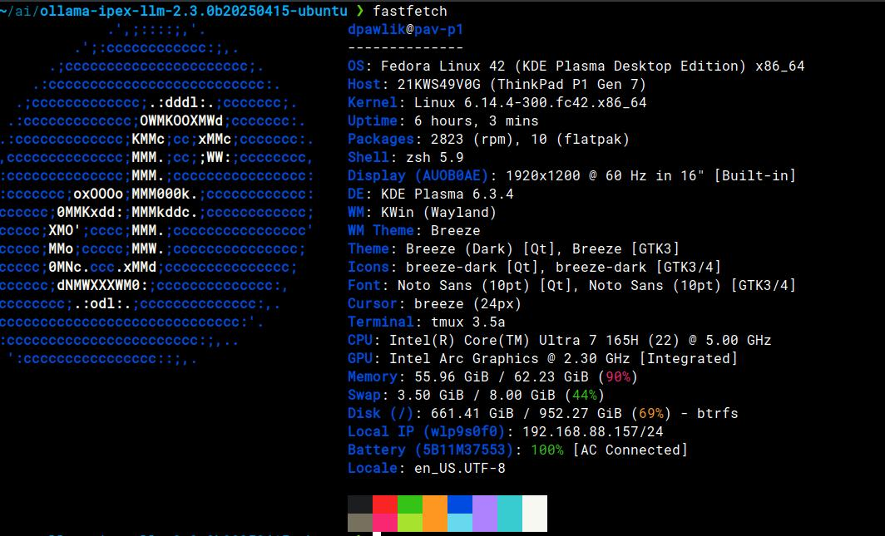
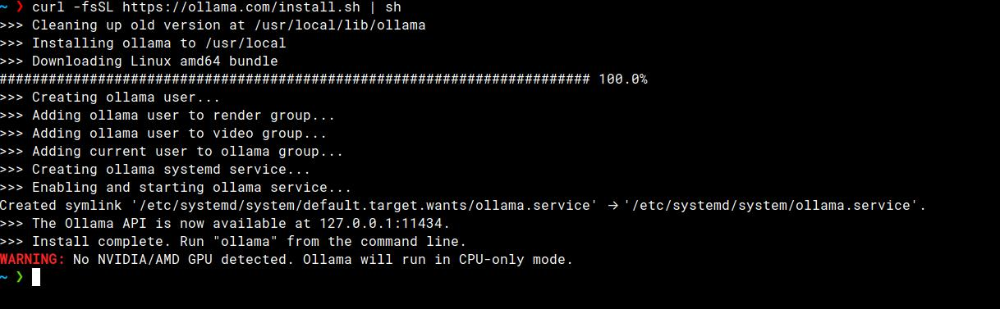

# Introduction

The Ollama framework is used for running and managing large languagel models (LLMs)
on local computer such as laptop.
As a company employee (Red Hat), I recently received a new company laptop - Lenovo ThinkPad P1G7:
which have NPU (Neural Processing Unit), but no graphic card with CUDA,
so it raises some complications to start working on Ollama.
Let's see if the framework can be running on my laptop and let' try to make
some exploration with available models.


## System details

As I mentioned, my working laptop is: Lenovo P1 G7. Below screen shoot from
fastfetch (neofetch is not developed anymore :( )




## Is possible to run Ollama without Intel fork? Let's see

On the beginning of that adventure, I installed the ollama using the
most common installation script available on theirs [page](https://ollama.com/download).
Before that, let' see what the script is [doing](https://ollama.com/install.sh)

Note: I was not aware about the main requirements for the Ollama, which is: CUDA.


And after executing script...



```shell
~ ❯ curl -fsSL https://ollama.com/install.sh | sh                                                                                                     ✘ 0|INT 14s 15:37:49
>>> Cleaning up old version at /usr/local/lib/ollama
>>> Installing ollama to /usr/local
>>> Downloading Linux amd64 bundle
######################################################################## 100.0%
>>> Creating ollama user...
>>> Adding ollama user to render group...
>>> Adding ollama user to video group...
>>> Adding current user to ollama group...
>>> Creating ollama systemd service...
>>> Enabling and starting ollama service...
Created symlink '/etc/systemd/system/default.target.wants/ollama.service' → '/etc/systemd/system/ollama.service'.
>>> The Ollama API is now available at 127.0.0.1:11434.
>>> Install complete. Run "ollama" from the command line.
WARNING: No NVIDIA/AMD GPU detected. Ollama will run in CPU-only mode.
```

Eh, what's now?
For sure I need to uninstall what has been done using the [guide](https://github.com/ollama/ollama/blob/main/docs/linux.md#uninstall)
and let's search for another solution.

## Intel Ipex llm

After quick Googling, I spotted some project on Github that might be interesting
and can "fit" my requirement - it was Intel Ipex llm available [here](https://github.com/intel/ipex-llm).
Of course there are many projects in Google, that are possitioned higher than
this one - right now AI is very hot topic.
